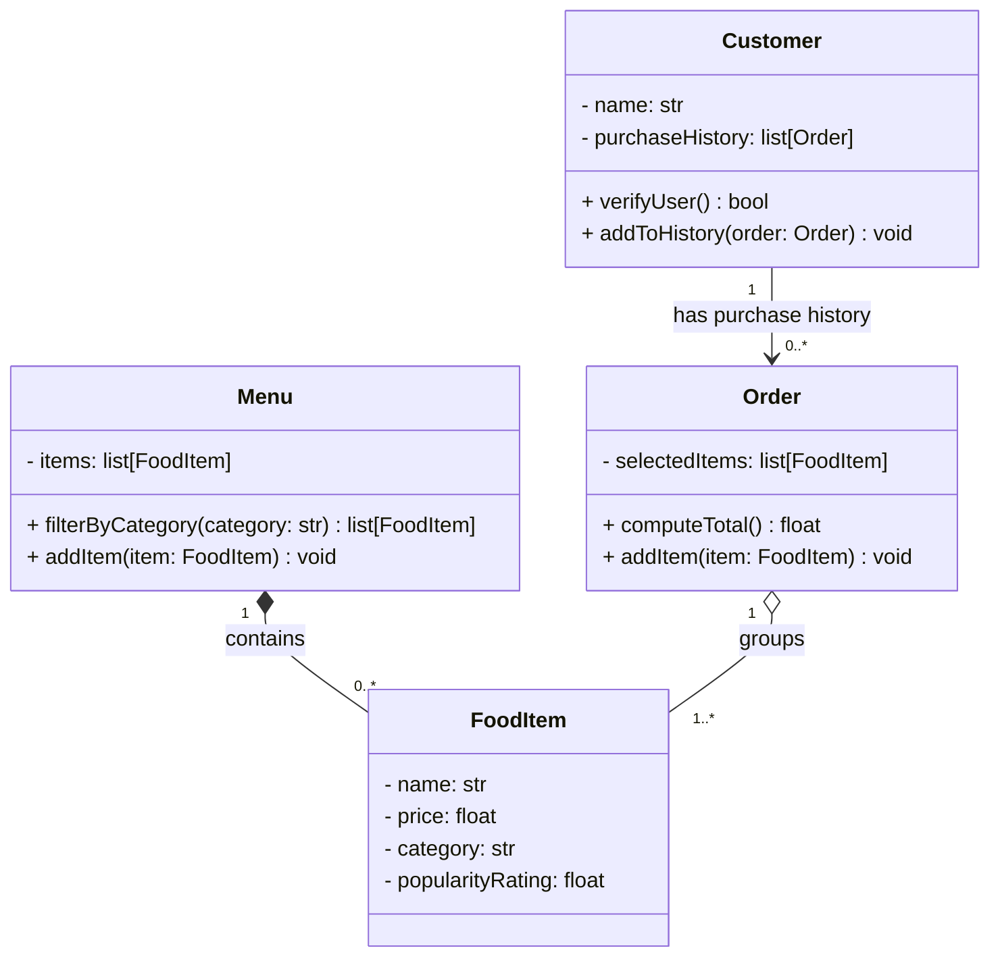

```mermaid
classDiagram
    class Customer {
        - name: str
        - purchaseHistory: list[Order]
        + verifyUser() bool
        + addToHistory(order: Order) void
    }

    class FoodItem {
        - name: str
        - price: float
        - category: str
        - popularityRating: float
    }

    class Menu {
        - items: list[FoodItem]
        + filterByCategory(category: str) list[FoodItem]
        + addItem(item: FoodItem) void
    }

    class Order {
        - selectedItems: list[FoodItem]
        + computeTotal() float
        + addItem(item: FoodItem) void
    }

    Customer "1" --> "0..*" Order : has purchase history
    Menu "1" *-- "0..*" FoodItem : contains
    Order "1" o-- "1..*" FoodItem : groups
```