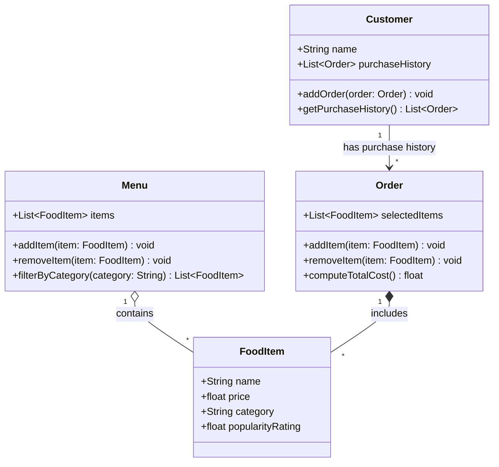

```mermaid
classDiagram
    class Customer {
        +String name
        +List~Order~ purchaseHistory
        +addOrder(order: Order) void
        +getPurchaseHistory() List~Order~
    }

    class FoodItem {
        +String name
        +float price
        +String category
        +float popularityRating
    }

    class Menu {
        +List~FoodItem~ items
        +addItem(item: FoodItem) void
        +removeItem(item: FoodItem) void
        +filterByCategory(category: String) List~FoodItem~
    }

    class Order {
        +List~FoodItem~ selectedItems
        +addItem(item: FoodItem) void
        +removeItem(item: FoodItem) void
        +computeTotalCost() float
    }

    Menu "1" o-- "*" FoodItem : contains
    Order "1" *-- "*" FoodItem : includes
    Customer "1" --> "*" Order : has purchase history
```